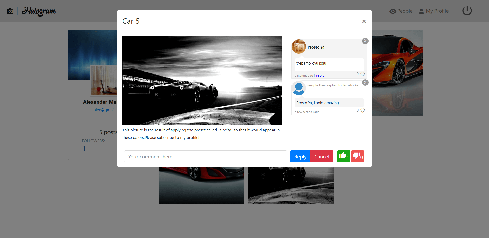
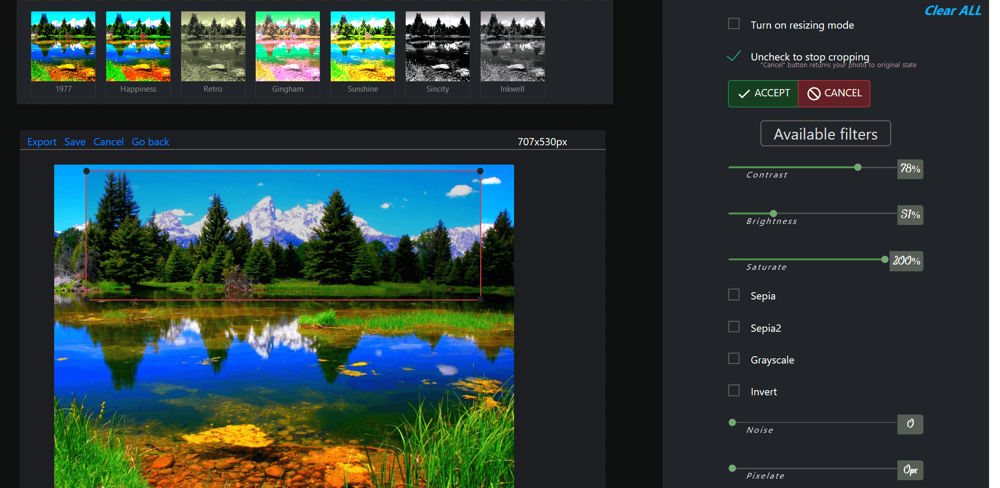
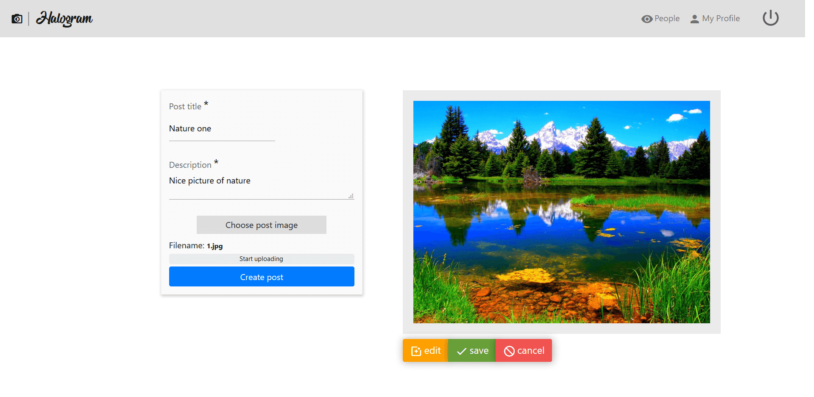

Halogram is essentially a clone of Instagram.
It is equipped with authentication feature, so every user has his own profile.

Users are allowed to change profile photo, follow other users and perform different operations with posts.
Every single post has to include photo,title and description. When the post is available other users have the opportunity to evaluate it by posting a comment, liking or disliking it.

Commenting system gives users the right to reply to any comment, like it or unlike it.

The central feature of the app is the image editor which is very versatile and makes use of the library fabric.js.

This editor allows user to resize,trim photo as well as apply different filters such as sepia, grayscale and regulate their strength in control panel. Once the image was edited, user faces a choice - to continue with this photo or just return back to 'create post' component and proceed with the original one.

